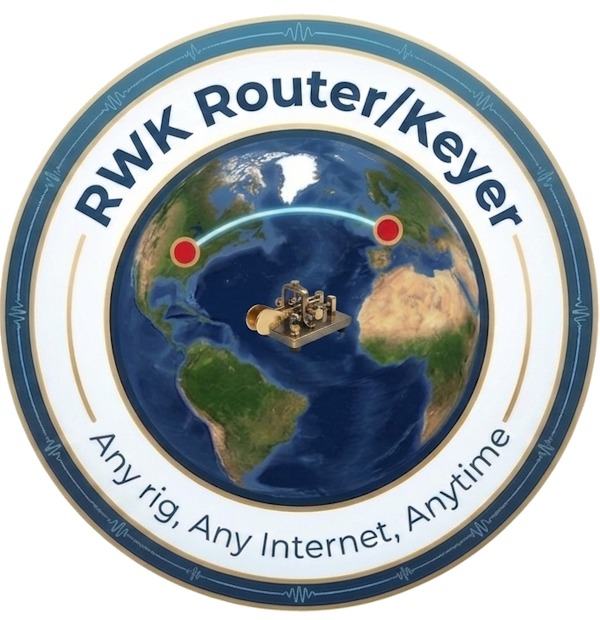
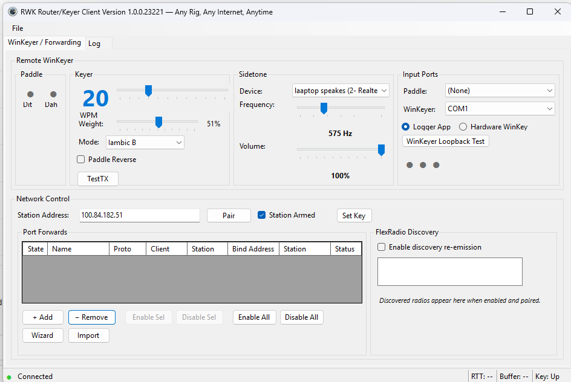
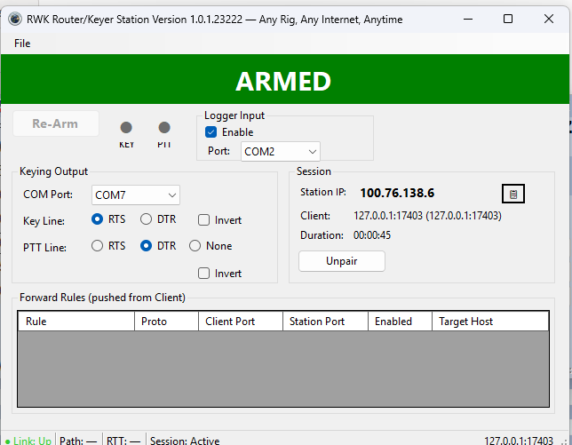
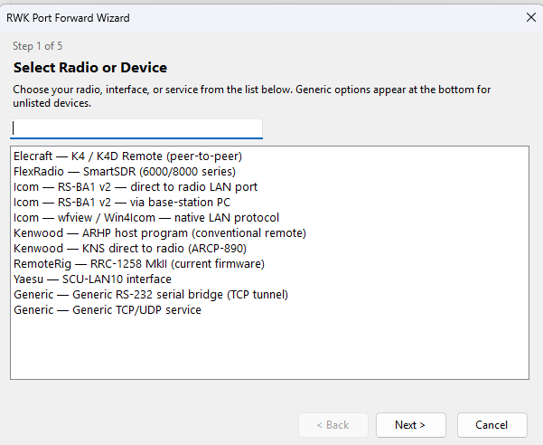

# RWK Router/Keyer v1.0.1

<p align="center">
  
</p>

**Any Rig, Any Internet, Anytime.**

Free, open-source CW remoting and port forwarding for amateur radio -- hand-generated Morse code sent across any internet connection without timing distortion.

[](LICENSE)
[]()
[]()
[]()

---

## What's New in v1.0.1

### New Features

- **Port Forward Wizard** -- A guided 5-step wizard inside the Client that configures port forwarding rules for your specific radio and control software. Supports Icom RS-BA1/wfview, Kenwood KNS/ARHP, Yaesu SCU-LAN10, FlexRadio SmartSDR, Elecraft K4, RemoteRig RRC-1258, generic RS-232 bridge, and ancillary services (rigctld, rotctld, RDP, VNC).
- **Import Profiles** -- Load a previously saved `.rwkprofile.json` to restore or share configurations.
- **Station Logger WinKeyer Input** -- Station accepts WK2 protocol CW macros from logging software (N1MM+, DXLog) running via Remote Desktop. Logger CW takes priority over remote paddle.
- **Hardware WinKeyer Support (WK2/WK3)** -- Client drives a physical K1EL WinKeyer chip. Supports WK3 (version 31+).
- **Improved Jitter Buffer** -- Direct path maximum raised to 300ms for Starlink/satellite links.

### Bug Fixes

- Tailscale login panel never appeared on fresh installs (multiple causes fixed)
- "Delete Tailscale Authorization" file lock error
- Hardware WinKey mode: Admin Open on mode switch, WK3 single-byte response, paddle echo enabled, sidetone muted
- COM port handling: (None) option, uniqueness enforced, mode persisted
- Station Logger settings persisted across restarts
- DPI scaling fixes for sidetone labels and mode controls
- Installer auto-uninstalls previous version

---

## Why This Project Exists

Remote amateur radio operation has a fundamental problem: **hand-generated CW cannot tolerate network latency and jitter.** When an operator sends Morse code with a paddle, each dit and dah is precisely timed -- a 25 WPM dit is exactly 48 milliseconds. If those timing events cross a network with variable delay, the code arrives distorted. Characters merge, spacing is destroyed, and the result is unreadable.

Commercial solutions exist (Icom RS-BA1, Kenwood KNS, Yaesu SCU-LAN10, FlexRadio SmartLink), but they all require a public IP address or router port forwarding. If you're on **Starlink, cellular, or behind CGNAT** -- which is increasingly common -- these solutions simply don't work.

**RWK solves both problems:**

1. **Timing-accurate CW remoting** -- The keyer runs at the operator's position. Edge transitions are timestamped with microsecond-resolution QPC clocks, packed into UDP datagrams, and replayed at the remote station with an adaptive jitter buffer. Accuracy within +/-2ms at 35 WPM.

2. **Zero-configuration private networking** -- RWK uses [Tailscale](https://tailscale.com) to create a private WireGuard mesh. No port forwarding, no dynamic DNS, no public IP. Works over any internet connection on either end. **Nothing to install on the computer** -- RWK ships its own embedded Tailscale sidecar.

---

## Three Independent Features

### 1. Remote WinKeyer (CW Remoting)
Sends hand-generated Morse code from a paddle or logger to a radio at a remote station. Requires pairing. This is the timing-critical path with fail-safe protection.

### 2. Port Forwarding (TCP/UDP Tunneling)
Tunnels arbitrary TCP and UDP traffic to the remote station's LAN. Used for CAT control, audio streaming, RemoteRig connections. Does not require pairing.

### 3. FlexRadio Discovery Relay (No SmartLink Required)
Discovers FlexRadio 6000/8000 series radios on the Station's LAN and makes them appear local -- without SmartLink, without a public IP, without Flex's cloud.

Use any feature alone or in combination.

---

## The Client



The Client runs at your operating position:

- **Paddle** -- Dit/Dah indicators. Connect paddle to a serial port.
- **Keyer** -- Speed (WPM), weight, mode (Iambic A/B, Ultimatic, Bug, Straight).
- **Sidetone** -- Local audio via WASAPI. Shares your sound card with receive audio.
- **Input Ports** -- Paddle port and WinKeyer port. "Logger App" or "Hardware WinKey" mode.
- **Port Forwards** -- TCP/UDP rules with Wizard and Import buttons.
- **Status Bar** -- Connection state, path type, RTT, key state.

---

## The Station



The Station runs at the remote radio site:

- **ARMED/SAFE Banner** -- Green = keying active. Red = fail-safe latched.
- **Logger Input** -- WK2 protocol from logging software on the Station PC.
- **Keying Output** -- COM port, Key Line (RTS/DTR), PTT Line, polarity.
- **Session** -- Paired Client info, Unpair button.
- **Forward Rules** -- Rules pushed from Client.

---

## The Port Forward Wizard



The fastest way to configure port forwarding. Select your radio, answer a few questions, click Apply. The Wizard creates rules, saves a profile, and opens a setup guide in Notepad.

**Supported radios:** Icom (RS-BA1, wfview), Kenwood (KNS, ARHP), Yaesu (SCU-LAN10), FlexRadio (SmartSDR), Elecraft (K4), RemoteRig (RRC-1258), plus generic serial bridge and TCP/UDP service entries.

The catalog lives in `Wizard\radios.json` -- community contributions welcome via pull request.

---

## Architecture

```
┌─────────────────────────────────────────────────────────────────────────────────┐
│                           OPERATOR POSITION (Client)                             │
│                                                                                 │
│  ┌──────────┐  ┌──────────────┐  ┌──────────────┐  ┌───────────────────────┐   │
│  │  Paddle  │  │   Logger     │  │  Hardware    │  │  Local Applications   │   │
│  │  (CTS/   │  │  (N1MM,      │  │  WinKeyer    │  │  (CAT, Audio, RRC)    │   │
│  │  DSR/DCD)│  │  DXLog, etc) │  │  (K1EL)      │  │                       │   │
│  └────┬─────┘  └──────┬───────┘  └──────┬───────┘  └───────────┬───────────┘   │
│       │ Serial         │ Serial          │ Serial               │ TCP/UDP       │
│       ▼                ▼                 ▼                      ▼               │
│  ┌─────────────────────────────────────────────────────────────────────────┐    │
│  │                     RWK Client Application                              │    │
│  │  ┌────────────┐ ┌───────────────┐ ┌───────────┐ ┌──────────────────┐   │    │
│  │  │ Paddle     │ │ WinKeyer      │ │ Soft      │ │ Port Forward     │   │    │
│  │  │ Input      │ │ Protocol Host │ │ Keyer     │ │ Manager          │   │    │
│  │  │ Poller     │ │ (Logger/HW)   │ │ Core      │ │ (TCP + UDP)      │   │    │
│  │  └─────┬──────┘ └───────┬───────┘ └─────┬─────┘ └────────┬─────────┘   │    │
│  │        └─────────────────┴───────────────┘                │             │    │
│  │                          │ UDP Edges                      │ TCP/UDP     │    │
│  │                          ▼                                ▼             │    │
│  │                 ┌──────────────────────────────────────────────┐         │    │
│  │                 │       Tailscale Sidecar (Go tsnet)           │         │    │
│  │                 └────────────────────┬────────────────────────┘         │    │
│  └──────────────────────────────────────┼──────────────────────────────────┘    │
└─────────────────────────────────────────┼───────────────────────────────────────┘
                                          │ WireGuard Mesh (Tailscale)
┌─────────────────────────────────────────┼───────────────────────────────────────┐
│  ┌──────────────────────────────────────┼──────────────────────────────────┐    │
│  │                 ┌────────────────────┴────────────────────────┐         │    │
│  │                 │       Tailscale Sidecar (Go tsnet)           │         │    │
│  │                 └──────┬─────────────────────────────┬────────┘         │    │
│  │                        ▼                             ▼                  │    │
│  │  ┌──────────────────────────────┐  ┌────────────────────────────────┐   │    │
│  │  │     Edge Replayer            │  │   Port Forward Manager         │   │    │
│  │  │  (TIME_CRITICAL thread,      │  │  (inbound TCP/UDP -> LAN)      │   │    │
│  │  │   jitter buffer, anchor)     │  │                                │   │    │
│  │  └────────────┬─────────────────┘  └──────────────┬─────────────────┘   │    │
│  │               ▼                                   ▼                     │    │
│  │  ┌────────────────────────┐         ┌──────────────────────────┐        │    │
│  │  │   Keying Output        │         │  Station LAN Devices     │        │    │
│  │  │   (Serial DTR/RTS)     │         │  (Radio, RRC, etc.)      │        │    │
│  │  └────────────┬───────────┘         └──────────────────────────┘        │    │
│  │               │              RWK Station Application                    │    │
│  └───────────────┼────────────────────────────────────────────────────────┘    │
│                  ▼              REMOTE STATION                                  │
│            ┌──────────┐                                                         │
│            │  Radio   │                                                         │
│            └──────────┘                                                         │
└─────────────────────────────────────────────────────────────────────────────────┘
```

---

## Core Technology: Timing-Accurate CW Remoting

At 25 WPM, a dit is 48ms. At 35 WPM, 34ms. Internet jitter is typically 20-100ms. RWK separates the **timing decision** from the **physical keying:**

1. **Client:** Paddle polled at 1ms on a dedicated thread. QPC-timestamped edges generated by the soft keyer on a `THREAD_PRIORITY_HIGHEST` thread.
2. **Network:** Edges packed into UDP datagrams (RWK-PADDLE frames) with sequence numbers and relative timestamps. True UDP over WireGuard mesh.
3. **Station:** `THREAD_PRIORITY_TIME_CRITICAL` replay thread. Adaptive jitter buffer. Anchor system resets after idle. Result: **+/-2ms accuracy at 35 WPM.**

### Fail-Safe Protection

- **F1:** No heartbeat 750ms while key down -> force key up
- **F2:** No heartbeat 3s while idle -> close session, latch SAFE
- **F3:** Continuous key 10s -> force key up
- **F6:** Serial port error -> latch SAFE
- **F9:** Tailscale path lost -> force key up

---

## Paddle Input vs Hardware WinKeyer

### Paddle Input (recommended)

Connect a paddle to the Client's Paddle port. RWK's software keyer handles all iambic timing locally with 1ms resolution.

**Advantages:**
- Local sidetone plays instantly (zero delay) through your sound device
- Sidetone can **share the same sound card** as receive audio -- hear your CW mixed with the other station
- Full speed range (5-60 WPM) with proper weighting
- No additional hardware beyond a paddle and serial port

### Hardware WinKeyer (K1EL WK2/WK3)

Select "Hardware WinKey" mode to drive a physical K1EL chip. The chip decodes paddle input, echoes decoded characters to RWK, and RWK re-generates CW for the remote Station.

**Trade-offs:**
- One-character decode delay (chip must finish the character before RWK can send it)
- **Local sidetone is muted** -- use the WinKeyer's own sidetone (it plays in real time)
- WinKeyer sidetone cannot be mixed with receive audio on the same sound card

---

## Paddle Wiring and Cable Building

### How It Works

The paddle connects to a serial port (real or USB-to-serial adapter). RWK uses the serial port's **modem control lines** to detect paddle contact closures:

- **DTR (pin 4)** is asserted by RWK software as a voltage source (~+5V to +12V depending on adapter)
- **Paddle common** connects to DTR
- **Dit contact** connects DTR through to **CTS (pin 8)** when closed
- **Dah contact** connects DTR through to **DSR (pin 6)** when closed
- **Straight key** (optional) connects DTR through to **DCD (pin 1)** when closed
- **GND (pin 5)** is the cable shield/ground (not connected to paddle common)

When you squeeze dit, the paddle contact closes and connects DTR voltage to the CTS input pin. RWK's poller detects CTS going active and registers a dit closure. No external power supply is needed -- the serial port provides the voltage on DTR.

### Wiring Diagram

```
                    USB-Serial             DB-9 Breakout
                    Adapter                Board
                    ┌─────┐               ┌──────────────┐
                    │     │               │              │
   Computer USB ────┤     ├── DB-9 ───────┤ Pin 4 (DTR)  ├──── Paddle COMMON
                    │     │               │              │     (center terminal)
                    └─────┘               │ Pin 8 (CTS)  ├──── Dit contact
                                          │              │
                                          │ Pin 6 (DSR)  ├──── Dah contact
                                          │              │
                                          │ Pin 1 (DCD)  ├──── Straight key
                                          │              │     (optional)
                                          │ Pin 5 (GND)  ├──── Shield/ground
                                          │              │     (cable shield only)
                                          └──────────────┘
```

**Important:** The paddle COMMON terminal connects to **DTR (pin 4)**, NOT to GND (pin 5). DTR provides the voltage that the input pins (CTS, DSR, DCD) need to detect a contact closure. GND is only for the cable shield.

### What You Need

1. **USB-to-serial adapter** -- Any standard USB-to-RS232 adapter with a DB-9 male connector. FTDI or Prolific chipsets work well. (~$10-15 on Amazon)

2. **DB-9 screw terminal breakout board** -- A small PCB that converts DB-9 pins to labeled screw terminals. No soldering required. Search Amazon for "DB9 breakout board screw terminal" (~$5-8). Example: [DB9 Female Breakout Board](https://www.amazon.com/dp/B07DC1MGSX)

3. **Paddle cable** -- Your paddle likely has a 1/4" stereo (TRS) plug or 3.5mm stereo plug:
   - Tip = Dit
   - Ring = Dah
   - Sleeve = Common

   Cut an extension cable or use a breakout adapter to access the three wires.

### Assembly

1. Plug the DB-9 breakout board into the USB-serial adapter (or use a short DB-9 extension cable between them).
2. Strip the paddle cable wires and connect to the screw terminals:
   - **Common/Sleeve** wire -> terminal for **Pin 4 (DTR)**
   - **Dit/Tip** wire -> terminal for **Pin 8 (CTS)**
   - **Dah/Ring** wire -> terminal for **Pin 6 (DSR)**
   - Cable shield (if separate) -> terminal for **Pin 5 (GND)**
3. Plug the USB adapter into your computer.
4. In RWK Client, select the COM port in the Paddle dropdown.
5. Test: squeeze the paddle -- the Dit/Dah indicators should light up and you should hear sidetone.

### Software Debounce

RWK applies 5ms debounce (configurable) to the paddle contacts. This prevents false triggers from contact bounce. The poller runs at 1ms intervals on a high-priority thread for responsive feel.

---

## FlexRadio Discovery Relay -- No SmartLink Required

### The Problem

FlexRadio's SmartLink requires a public IP, port forwarding, or cloud relay. On CGNAT/Starlink/cellular, it doesn't work.

### The Solution

RWK intercepts VITA-49 discovery broadcasts at the Station, rewrites the endpoint fields, and re-emits them on the Client's LAN. SmartSDR discovers the radio and connects through the forwarded ports.

**Technical details:**
- VITA-49 encapsulation: 28-byte preamble, stream ID 0x800, Flex OUI class ID
- ASCII payload with key=value pairs (model, serial, ip, port, status)
- Rewrite preserves all fields except `ip=` and `port=`
- Station binds with SO_REUSEADDR so local SmartSDR still works

**Setup:**
1. Port forward TCP 4992 (command) + UDP ports as needed
2. Enable "discovery capture" on Station
3. Enable "discovery re-emission" on Client
4. Open SmartSDR -- radio appears in discovery list

---

## Installation

### Requirements

- Windows 10/11 x64
- Internet connectivity (any type)
- Free [Tailscale](https://tailscale.com) account
- Serial port for paddle and/or radio keying (USB adapters work)

### Running the Installer

1. Download `RWK-Setup.exe` from [GitHub Releases](https://github.com/w1ve/rwk-router-keyer/releases)
2. Run it -- no admin rights needed. Installs to `%LOCALAPPDATA%\RWK Router Keyer\`
3. Previous versions are automatically uninstalled first.
4. Choose: Client only, Station only, or both.

---

## Tailscale Authentication

Both Client and Station must join your Tailscale network. This is a one-time setup.

### Option A: Browser Login (recommended)

1. Launch RWK. A login panel appears.
2. Click **Open Browser**. Sign in to Tailscale.
3. Authorize the device. Panel dismisses automatically.
4. Status bar shows "Connected" with IP (100.x.x.x).

Identity is persisted -- subsequent launches connect automatically.

### Option B: Auth Key (headless machines)

1. Go to https://login.tailscale.com/admin/settings/keys
2. Generate an auth key. Copy it (`tskey-auth-...`).
3. In RWK, click **Paste Auth Key Instead**. Paste and Submit.
4. No browser needed.

### Troubleshooting

- **Panel stays at "Waiting...":** Use Paste Auth Key instead.
- **Panel doesn't appear:** Already authenticated. Check status bar.
- **Reset auth:** File menu -> Delete Tailscale Authorization -> restart.

---

## Pairing (CW Remote Keying)

1. **Station:** File menu -> Show Pairing Key. Note the 8-character code.
2. **Client:** Enter Station's Tailscale IP in "Station Address".
3. **Client:** Click "Set Key", enter the pairing code.
4. **Client:** Click "Pair". Status shows "Paired".

Pairing is only for CW keying. Port forwarding works without it.

---

## Keying Output (Station Side)

The Station keys via DTR or RTS. For radios needing a key jack closure, use a transistor switch:

```
Serial DTR/RTS ──── 1k ohm ──── Base
                                 │
                              2N2222
                                 │
Radio Key Jack ──────────── Collector
Radio Key GND  ──────────── Emitter
```

**Rule:** Configure polarity so **dropped line = key up**. The fail-safe drops all lines on error.

---

## Building from Source

```bash
dotnet build RWK.sln -c Release
cd src/RWK.TailscaleSidecar && go build -o rwk-tailscale-sidecar.exe .
iscc build/installer/rwk-setup.iss
```

---

## Acknowledgments

- [Tailscale](https://tailscale.com) -- private networking made trivially easy
- [K1EL Electronics](https://www.k1el.com) -- the WinKeyer protocol that loggers universally support
- **Jim Talens, N3JT** -- invaluable feedback and testing across multiple configurations

---

## Feedback

Questions, bugs, feature requests, or catalog contributions:

**Email:** gerry@w1ve.com  
**GitHub Issues:** https://github.com/w1ve/rwk-router-keyer/issues

73 de W1VE
