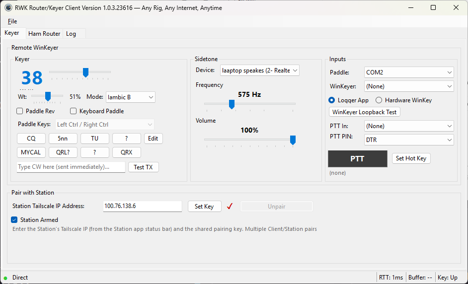
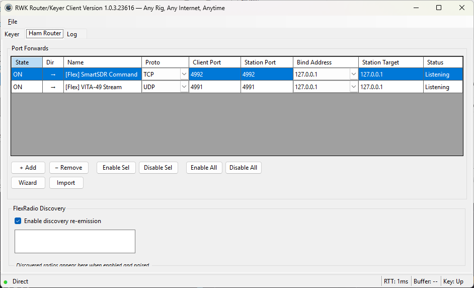
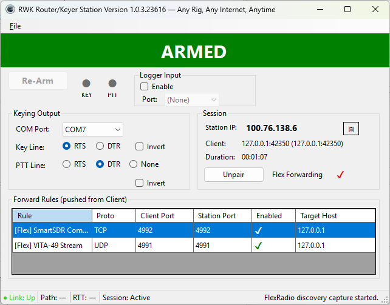
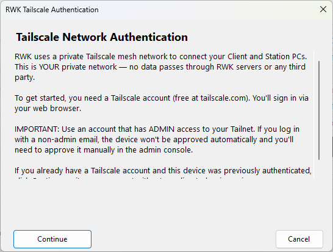
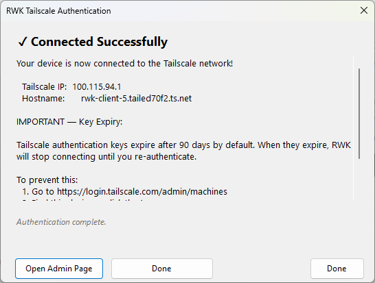
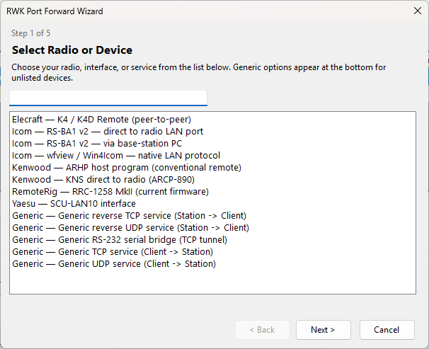
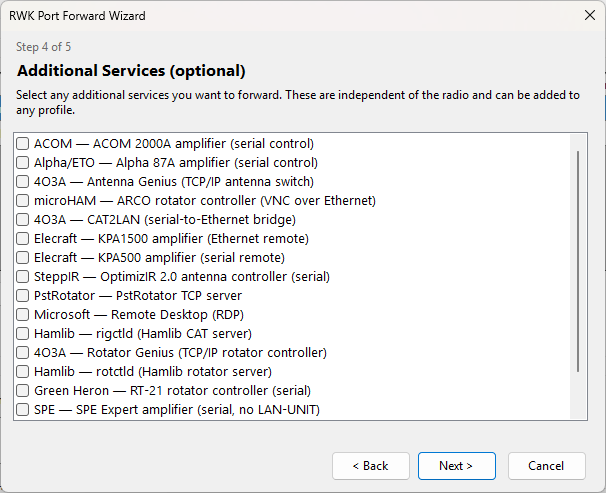

# RWK Router/Keyer v1.0.5

<p align="center">
  
</p>

**Any Rig, Any Internet, Anytime.**

Free, open-source CW remoting, SSB PTT control, and port forwarding for amateur radio -- hand-generated Morse code sent across any internet connection without timing distortion.

[](LICENSE)
[]()
[]()
[]()

---

## Recent Bug Fixes (later v1.0.5 builds)

A round of **safety and reliability** fixes shipped in later v1.0.5 builds:

- **Station could key the radio while not armed (critical).** The remote-edge keying path did not consult the SAFE latch or the armed state, so buffered or newly-arriving edges could key the transmitter even after a fail-safe latched (with the Re-Arm button showing). Keying is now hard-gated by a single interlock: the key line is asserted only while the Station is **armed AND not SAFE-latched**. When SAFE engages, any queued edges are purged and the key line is forced down. PTT-assert requests from the Client are gated by the same interlock.
- **N1MM / logger WinKeyer input could hang permanently.** After some use, the logger's WinKeyer indicator would turn red and stay red even after restarting the logger — only a Station restart recovered it. The Station now detects the logger closing the (virtual) COM port, resets the emulated WinKeyer session on reconnect, clears any half-received command after an inter-byte gap, and recovers the port after an I/O error instead of dying silently.
- **Session box could disagree with the real pairing state.** A rejected non-owner connection (BUSY / bad key / auth timeout) was raising the same "session ended" signal used for the active session, so the Unpair button greyed out and the client showed "(none)" while keying and port forwards kept working. Rejections now use a separate, non-destructive notification. The Session box is also continuously reconciled against the authoritative session, and a dropped control channel now ends the session — so the box **always** reflects the true pairing state.
- **Serial port open failures are now recoverable and visible.** Opening the keying port or the logger port now retries once automatically (which clears most transient virtual-COM hiccups). If the second attempt still fails, a dialog reports the port and error and suggests restarting VSPE / freeing the port, instead of failing silently.
- **Client: imported Stations were not being saved.** Since the move to Program Files, the station list was being written next to the executable (not writable), so imports vanished on restart. The list is now stored under `%AppData%\RWK Client\` and persisted immediately on import, with automatic migration of any prior list.

These later builds also add two convenience/safety features:

- **In-app update check.** On startup each app checks GitHub for a newer build and, if one exists, shows a notice just above the status bar: *"New version 1.x.x.nnnn available — Install."* Clicking Install downloads and launches the latest installer (after a brief note about Windows SmartScreen), then closes the app so it can update.
- **Version-mismatch warning on pair.** When the Client pairs with a Station running a different version (or an older Station that predates this check), it warns the operator and offers to cancel the pairing, since mismatched versions can cause keying problems.

---

## What's New in v1.0.5

Version 1.0.5 adds **IPv6 support**, a streamlined **Station import/pair workflow**, and hardens the logger (WinKeyer) input path. It also brings a round of UI polish and quality-of-life fixes.

### Highlights

- **IPv6 Support** -- Edge data and port forwarding work over IPv6 tailnets (dual IPv4/IPv6 listeners in the sidecar)
- **Station Import Workflow** -- Import a Station by pasting its "Station Info" string; pick it from a dropdown instead of typing an IP and key
- **Copy Station Info** -- Station menu exports `TailscaleIP|Key` to the clipboard in one click
- **Clear Hot Key** -- The PTT hot key button toggles to "Clear Hot Key" once a key is assigned
- **Hot Keys Are Consumed** -- PTT hot key and keyboard-paddle keystrokes no longer leak to the focused app (modifiers still pass through)
- **Sound Card Picker Fixed** -- Selecting a sidetone output device now actually switches it
- **Toast Notifications** -- Pair/unpair, connect/disconnect, minimize, and error toasts (works minimized too)
- **Fixed-Size Window** -- Minimize + close only, for consistent layout across resolutions
- **Program Files Install** -- Installs to `Program Files\W1VE Software\RWK Router Keyer`

### New Features and Enhancements

- **IPv6** -- The Go sidecar listens on both IPv4 and IPv6 for UDP forwarding; address handling and validation accept v4, v6, or both. (See ADR 0002.)
- **Station Import / Pair UX** -- The old "Station IP + Set Key" area is replaced by a "Station:" dropdown plus an "Import..." button. Paste the Station Info string, name it (20 chars max), and it's saved to the dropdown. Changing the selected station while paired auto-unpairs first.
- **Copy Station Info to Clipboard** -- Replaces the Station's "Show Pairing Key" menu item; exports `TailscaleIP|Key`.
- **PTT Hot Key** -- Once set, the button reads "Clear Hot Key" and clears the assignment when clicked. Hot key state persists across restarts.
- **Global Key Capture** -- PTT hot key and keyboard-paddle keys are eaten by the low-level hook so they don't reach other windows; modifier keys are passed through so normal typing is unaffected.
- **DLI Web Power Switch** -- New Digital Loggers entry in the port-forward wizard (catalog v4, 31 entries), with an AutoPing tip for power-cycling a stuck router/modem.
- **Inputs Panel Rework** -- DCD = PTT (footswitch) moved under the Paddle dropdown; "Logger App" / "Hardware WinKey" stacked with a per-selection help line; loopback test button removed.

### Bug Fixes

- Fixed a WinKeyer hang when a logger (e.g. N1MM) drove the Station's logger input -- serial writes are now serialized behind a single lock, with an idle-timeout safety net and a text-buffer drain
- Fixed logger input configured before the Station was armed -- the start intent is now retained and retried on arm
- Fixed the sidetone output-device selector, which was never wired
- Speed and Weight sliders now size from the group's real width so they render correctly across display resolutions; the Weight slider no longer overlaps the Mode dropdown and the WPM readout is no longer clipped

---

## What's New in v1.0.4

Version 1.0.4 is a major usability release focused on **preventing operators from shooting themselves in the foot.** The UI now guides you through every step: Tailscale authorization uses a 5-step wizard, port forwarding has a catalog-driven wizard with 31 radio/service presets, and the Keyer and Inputs panels are disabled until you successfully pair -- making it impossible to accidentally key a transmitter before a session is established.

### Highlights

- **Tailscale Auth Wizard** -- 5-step guided Tailscale login replaces the old manual process
- **Port Forward Wizard** -- 31 radio/service presets, serial bridge generation, bidirectional forwarding
- **SSB PTT Support** -- Momentary PTT button, global hotkey, and footswitch COM port input
- **8 CW Macro Buttons** -- Two rows of 4, editable, with sensible defaults
- **Three CW Keying Methods** -- Paddle keys, macro buttons, and live type-ahead
- **FlexRadio Auto-Forwarding** -- Discovery checkbox auto-creates required port forward rules
- **Log Rotation** -- 10KB max per log file with automatic rotation (-1, -2, etc.)
- **UI Safety** -- Keyer/Inputs panels greyed out until paired; red Pair button

---

### New Features

- **SSB PTT Button** -- Big momentary PTT button in the Inputs panel. MouseDown = transmit, MouseUp = release. Works for SSB operators who need PTT without CW keying.
- **PTT Global Hotkey** -- "Set Hot Key" captures any key combo (e.g. Alt+P). Hotkey is momentary like the button. Enabled only while paired, disabled on close.
- **PTT Footswitch Input** -- Dedicated COM port in the Inputs panel monitors DSR or CTS at 10ms intervals. Connect a footswitch for hands-free PTT.
- **8 CW Macro Buttons** -- Two rows of four: CQ, 599, TU, 73, MYCALL, QRL?, ?, QRX (all editable and persistent).
- **Type-Ahead CW** -- Text box sends each character immediately through the keyer as you type.
- **Tailscale Auth Wizard** -- Welcome, Browser OAuth, Verify, Authorization Required, Success (with key expiry warning). Replaces the confusing manual login panel.
- **Port Forward Wizard** -- 31 catalog entries for radios (Icom, Kenwood, Yaesu, Elecraft, RemoteRig, 4O3A, Green Heron, SPE, SteppIR, Alpha, ACOM) and services. Generates rules, profiles, and setup guides.
- **Bidirectional Port Forwarding** -- Rules can be Client-to-Station (forward) or Station-to-Client (reverse). Direction shown with arrow indicators in the grid.
- **Serial Bridge Sub-Flow** -- Wizard generates VSPE configuration XML and com2tcp command lines for RS-232 CAT control.
- **FlexRadio Auto-Forwarding** -- Checking "Enable discovery re-emission" auto-creates TCP 4992 and UDP 4991 rules with correct StationTargetAddress from the radio's VITA-49 announcement.
- **Keyboard Paddle** -- Global key hook with 7 presets (Left/Right Ctrl, Shift, Z/X, comma/period, F/J, A/L, brackets). Combo disabled when unchecked.
- **Log Rotation** -- All file logs rotate at 10KB (up to 5 rotated files per log).
- **Delete Debugging Logs** -- File menu item on both Client and Station deletes all log files.
- **CW Announcements Sidetone-Only** -- "OK READY", "AS", "KEYER BUSY" announcements play through sidetone without keying the transmitter.
- **Windows Firewall Rules** -- Installer creates inbound allow rules for all three executables.

### Bug Fixes

- CW announcements (AS, OK READY, KEYER BUSY, AS UNPAIRED) were keying the transmitter -- now sidetone only
- FlexVitaDiscoveryCodec rejected newer SmartUnlink class ID format -- now accepts both
- Concurrent TCP control stream writes corrupted length-prefixed framing (added batch suppression)
- Empty forward rule push did not reach Station (early-return on zero rules)
- Weight slider and Mode combo obscured at high DPI -- repositioned with proper spacing
- Choppy CW at 290ms RTT on Starlink -- raised DirectMaxDelay from 150ms to 300ms
- Tailscale login panel never appeared on fresh installs (5 root causes fixed)
- "Delete Tailscale Authorization" file lock error (sidecar stopped before delete)
- DPI scaling: sidetone labels, mode combo, TestTX button all repositioned
- "PLEASE WAIT" overlay now a visible white box with border, centered on window
- Installer auto-uninstalls previous version before installing

---

## The Client



The Client runs at your operating position. The UI is organized into three tabs: **Keyer**, **Ham Router**, and **Log**.

The Keyer and Inputs panels are **disabled (greyed out) until you pair with a Station** -- preventing accidental keying before a session is established.

### Keyer Panel

- **Speed** -- Large WPM readout with slider (5-60 WPM)
- **Weight** -- Element weighting (25-75%)
- **Mode** -- Iambic A, Iambic B, Ultimatic, Bug, Straight
- **Paddle Rev** -- Swap dit/dah contacts
- **Keyboard Paddle** -- Key CW with your computer keyboard (7 key-pair presets)
- **8 Macro Buttons** -- Two rows of 4, fully editable (Edit button). Defaults: CQ, 599, TU, 73, MYCALL, QRL?, ?, QRX
- **Type-Ahead** -- Text box for live CW typing (each character sent immediately)
- **Test TX** -- Sends "VVV TESTING" to verify the keying path

### Inputs Panel

- **Paddle** -- COM port for physical paddle
- **WinKeyer** -- COM port for logger WK2 emulation or hardware K1EL chip
- **PTT In** -- COM port for footswitch (monitors DSR or CTS)
- **PTT PIN** -- Select DTR or RTS for the footswitch input line
- **PTT Button** -- Big momentary button (hold to transmit)
- **Set Hot Key / Clear Hot Key** -- Capture any key combo as a PTT hotkey; the button toggles to "Clear Hot Key" once set
- **Logger App / Hardware WinKey** -- Mode selection for WinKeyer port

### Pair with Station

- **Import...** a Station by pasting its "Station Info" string, then pick it from the **Station:** dropdown
- **Red "Pair with Station" button** indicates you are not yet paired
- Once paired, the button changes to "Unpair" (normal colors) and panels enable
- Changing the selected station while paired auto-unpairs first

---

## The Ham Router Tab



Full-height port forwarding grid with:

- **Direction** -- Arrow indicators (Client-to-Station or Station-to-Client)
- **Rule Name, Protocol, Client Port, Station Port, Target Address, Status**
- **Enable/Disable Selected**, **Enable/Disable All** buttons
- **Add/Remove** rules manually
- **Wizard** -- Catalog-driven configuration (see below)
- **Import** -- Load a saved `.rwkprofile.json`
- **FlexRadio Discovery** -- Checkbox auto-manages Flex forward rules

---

## The Station



The Station runs at the remote radio site:

- **ARMED/SAFE Banner** -- Green = keying active. Red = fail-safe latched.
- **KEY/PTT LEDs** -- Real-time keying and PTT state indicators
- **Keying Output** -- COM port, Key Line (RTS/DTR), PTT Line, polarity
- **Session** -- Paired Client info, Unpair button, Flex Forwarding indicator
- **Forward Rules** -- Rules pushed from Client with enabled/disabled state
- **Logger Input** -- WK2 protocol from logging software on the Station PC

---

## Tailscale Auth Wizard

The Tailscale Auth Wizard guides you through network setup in 5 steps:



**Step 1: Welcome** -- Explains what Tailscale is and why RWK uses it.  
**Step 2: Browser OAuth** -- Opens your browser for Tailscale login.  
**Step 3: Verify** -- Polls for authorization completion.  
**Step 4: Authorization Required** -- Handles cases where admin approval is needed.  
**Step 5: Success** -- Shows your Tailscale IP and warns about key expiry.



The wizard appears automatically on first launch. After successful auth, RWK connects automatically on every subsequent launch.

---

## The Port Forward Wizard

The Wizard makes port forwarding configuration trivial. Select your radio type, answer a few questions, and click Apply.

### Radio Selection



**31 catalog entries** covering:
- **Icom** -- RS-BA1, wfview
- **Kenwood** -- KNS, ARHP
- **Yaesu** -- SCU-LAN10
- **FlexRadio** -- SmartSDR (auto-managed via discovery)
- **Elecraft** -- K4
- **RemoteRig** -- RRC-1258
- **4O3A, Green Heron, SPE, SteppIR, Alpha, ACOM** -- Rotator/amplifier/accessory control
- **Generic** -- TCP forward, UDP forward, RS-232 serial bridge (with VSPE generation)

### Services



Add ancillary services: rigctld, rotctld, RDP, VNC, and custom TCP/UDP forwards. Each generates appropriate Client-to-Station or Station-to-Client rules.

### Bidirectional Forwarding

Port forwarding now supports **both directions**:
- **Client-to-Station (default)** -- Client binds a local port and tunnels to Station LAN
- **Station-to-Client** -- Station originates traffic back to the Client

Direction is shown with arrow indicators in the forwarding grid.

---

## Three CW Keying Methods

RWK offers three ways to send CW, all routed through the same keyer engine and timing-accurate network path:

### 1. Paddle Keys (Physical or Keyboard)

Connect a physical paddle to a serial port, or use the Keyboard Paddle with any of 7 key-pair presets. The software keyer generates proper iambic timing locally at 1ms resolution.

### 2. CW Macro Buttons

Eight pre-programmed buttons send stored CW text through the keyer. Defaults:
| Button | Sends |
|--------|-------|
| CQ | CQ DE MYCALL |
| 599 | 599 |
| TU | TU |
| 73 | 73 |
| MYCALL | MYCALL |
| QRL? | QRL? |
| ? | ? |
| QRX | QRX |

All labels and texts are editable and persist across restarts.

### 3. Type-Ahead

A text input box sends each character through the keyer as you type. Supports all printable ASCII characters, immediately converted to properly-timed CW.

---

## SSB PTT Control

For SSB operators who need to assert PTT without CW keying:

### PTT Button

A large momentary button in the Inputs panel. Hold it down to transmit, release to stop. Visual feedback: button turns red while active.

### PTT Global Hotkey

Click "Set Hot Key", then press any key combo (e.g. Ctrl+Shift+P, F9, Alt+Space). The hotkey works globally -- you can be in any application and the hotkey triggers PTT. Displayed in plain English below the PTT button. Once set, the button becomes "Clear Hot Key" to remove the assignment.

The hotkey keystroke is **consumed** and does not leak to the focused application (modifier keys still pass through). The hotkey is **enabled only while paired** and disabled on unpair or app close.

### PTT Footswitch (COM Port)

Select a COM port in "PTT In" and choose the pin to monitor (DTR reads as DSR, RTS reads as CTS). Connect a footswitch that grounds the selected line when pressed.

```
┌─────────────────────────────────────────────────────────────────┐
│                    PTT Input Sources                             │
│                                                                 │
│  ┌──────────────┐  ┌───────────────┐  ┌─────────────────────┐  │
│  │  PTT Button  │  │  Global       │  │  Footswitch         │  │
│  │  (UI click)  │  │  Hotkey       │  │  (COM port DSR/CTS) │  │
│  └──────┬───────┘  └───────┬───────┘  └──────────┬──────────┘  │
│         └───────────────────┴─────────────────────┘             │
│                             │                                   │
│                    ┌────────▼────────┐                          │
│                    │ ClientController │                          │
│                    │ AssertPtt() /    │                          │
│                    │ DeassertPtt()    │                          │
│                    └────────┬────────┘                          │
│                             │ Control Channel                   │
│                             │ {"type":"ptt_assert"}             │
│                             │ {"type":"ptt_deassert"}           │
│                             ▼                                   │
│                    ┌─────────────────┐                          │
│                    │ Station PTT     │                          │
│                    │ (serial DTR/RTS)│                          │
│                    └─────────────────┘                          │
└─────────────────────────────────────────────────────────────────┘
```

---

## Architecture

```
┌─────────────────────────────────────────────────────────────────────────────────┐
│                           OPERATOR POSITION (Client)                             │
│                                                                                 │
│  ┌──────────┐  ┌──────────────┐  ┌──────────────┐  ┌───────────────────────┐   │
│  │  Paddle  │  │  Logger      │  │  Hardware    │  │  Local Applications   │   │
│  │  (CTS/   │  │  (N1MM,      │  │  WinKeyer    │  │  (CAT, Audio, RRC)    │   │
│  │  DSR/DCD)│  │  DXLog, etc) │  │  (K1EL)      │  │                       │   │
│  └────┬─────┘  └──────┬───────┘  └──────┬───────┘  └───────────┬───────────┘   │
│       │ Serial         │ Serial          │ Serial               │ TCP/UDP       │
│       ▼                ▼                 ▼                      ▼               │
│  ┌─────────────────────────────────────────────────────────────────────────┐    │
│  │                     RWK Client Application                              │    │
│  │  ┌────────────┐ ┌───────────────┐ ┌───────────┐ ┌──────────────────┐   │    │
│  │  │ Paddle     │ │ WinKeyer      │ │ Soft      │ │ Port Forward     │   │    │
│  │  │ Input      │ │ Protocol Host │ │ Keyer     │ │ Manager          │   │    │
│  │  │ Poller     │ │ (Logger/HW)   │ │ Core      │ │ (TCP + UDP)      │   │    │
│  │  └─────┬──────┘ └───────┬───────┘ └─────┬─────┘ └────────┬─────────┘   │    │
│  │        └─────────────────┴───────────────┘                │             │    │
│  │                          │ UDP Edges                      │ TCP/UDP     │    │
│  │                          ▼                                ▼             │    │
│  │  ┌─────────────┐ ┌──────────────────────────────────────────────┐       │    │
│  │  │ PTT Control │ │       Tailscale Sidecar (Go tsnet)           │       │    │
│  │  │ (Button,    │ │                                              │       │    │
│  │  │  Hotkey,    ├─┤  UDP edge datagrams + TCP control channel    │       │    │
│  │  │  Footswitch)│ │  TCP/UDP port forwards                      │       │    │
│  │  └─────────────┘ └────────────────────┬───────────────────────┘        │    │
│  └───────────────────────────────────────┼─────────────────────────────────┘    │
└──────────────────────────────────────────┼──────────────────────────────────────┘
                                           │ WireGuard Mesh (Tailscale)
┌──────────────────────────────────────────┼──────────────────────────────────────┐
│  ┌───────────────────────────────────────┼─────────────────────────────────┐    │
│  │                 ┌─────────────────────┴───────────────────────┐         │    │
│  │                 │       Tailscale Sidecar (Go tsnet)           │         │    │
│  │                 └──────┬──────────────────────────────┬───────┘         │    │
│  │                        ▼                              ▼                 │    │
│  │  ┌──────────────────────────────┐  ┌──────────────────────────────────┐ │    │
│  │  │     Edge Replayer            │  │   Port Forward Manager           │ │    │
│  │  │  (TIME_CRITICAL thread,      │  │  (inbound TCP/UDP -> LAN)        │ │    │
│  │  │   jitter buffer, anchor)     │  │                                  │ │    │
│  │  └────────────┬─────────────────┘  └──────────────┬───────────────────┘ │    │
│  │               │                                   │                     │    │
│  │  ┌────────────▼────────────────┐    ┌─────────────▼────────────────┐    │    │
│  │  │   Keying + PTT Output      │    │  Station LAN Devices         │    │    │
│  │  │   (Serial DTR/RTS)         │    │  (Radio, RRC, Rotator, etc.) │    │    │
│  │  └────────────┬───────────────┘    └──────────────────────────────┘    │    │
│  │               │              RWK Station Application                    │    │
│  └───────────────┼────────────────────────────────────────────────────────┘    │
│                  ▼              REMOTE STATION                                  │
│            ┌──────────┐                                                         │
│            │  Radio   │                                                         │
│            └──────────┘                                                         │
└─────────────────────────────────────────────────────────────────────────────────┘
```

---

## Three Independent Features

### 1. Remote WinKeyer (CW Remoting)
Sends hand-generated Morse code from a paddle, keyboard, macros, or type-ahead to a radio at a remote station. Requires pairing. This is the timing-critical path with fail-safe protection.

### 2. Port Forwarding (TCP/UDP Tunneling)
Tunnels arbitrary TCP and UDP traffic between Client and Station LANs. Supports both directions. Used for CAT control, audio streaming, RemoteRig connections, rotator control, and more. Does not require pairing.

### 3. FlexRadio Discovery Relay (No SmartLink Required)
Discovers FlexRadio 6000/8000 series radios on the Station's LAN and makes them appear local -- without SmartLink, without a public IP, without Flex's cloud. Enabling the checkbox auto-creates required port forward rules.

Use any feature alone or in combination.

---

## Core Technology: Timing-Accurate CW Remoting

At 25 WPM, a dit is 48ms. At 35 WPM, 34ms. Internet jitter is typically 20-100ms. RWK separates the **timing decision** from the **physical keying:**

1. **Client:** Paddle polled at 1ms on a dedicated thread. QPC-timestamped edges generated by the soft keyer on a `THREAD_PRIORITY_HIGHEST` thread.
2. **Network:** Edges packed into UDP datagrams (RWK-PADDLE frames) with sequence numbers and relative timestamps. True UDP over WireGuard mesh.
3. **Station:** `THREAD_PRIORITY_TIME_CRITICAL` replay thread. Adaptive jitter buffer (Direct band 30-300ms, DERP band 100-500ms). Anchor system resets after idle. Result: **+/-2ms accuracy at 35 WPM.**

### Fail-Safe Protection

- **F1:** No heartbeat 750ms while key down -> force key up
- **F2:** No heartbeat 3s while idle -> close session, latch SAFE
- **F3:** Continuous key 10s -> force key up
- **F6:** Serial port error -> latch SAFE
- **F9:** Tailscale path lost -> force key up

---

## Paddle Input vs Hardware WinKeyer

### Paddle Input (recommended)

Connect a paddle to the Client's Paddle port. RWK's software keyer handles all iambic timing locally with 1ms resolution.

**Advantages:**
- Local sidetone plays instantly (zero delay) through your sound device
- Sidetone can **share the same sound card** as receive audio
- Full speed range (5-60 WPM) with proper weighting
- PageUp/PageDown adjusts speed +/-2 WPM globally

### Hardware WinKeyer (K1EL WK2/WK3)

Select "Hardware WinKey" mode to drive a physical K1EL chip. The chip decodes paddle input, echoes decoded characters to RWK, and RWK re-generates CW for the remote Station.

**Trade-offs:**
- One-character decode delay (chip must finish the character before RWK can send it)
- **Local sidetone is muted** -- use the WinKeyer's own sidetone
- WinKeyer sidetone cannot be mixed with receive audio on the same sound card

---

## Paddle Wiring and Cable Building

### How It Works

The paddle connects to a serial port (real or USB-to-serial adapter). RWK uses the serial port's **modem control lines** to detect paddle contact closures:

- **DTR (pin 4)** is asserted by RWK software as a voltage source
- **Paddle common** connects to DTR
- **Dit contact** connects DTR through to **CTS (pin 8)** when closed
- **Dah contact** connects DTR through to **DSR (pin 6)** when closed
- **Straight key** (optional) connects DTR through to **DCD (pin 1)** when closed

### Wiring Diagram

```
                    USB-Serial             DB-9 Breakout
                    Adapter                Board
                    ┌─────┐               ┌──────────────┐
                    │     │               │              │
   Computer USB ────┤     ├── DB-9 ───────┤ Pin 4 (DTR)  ├──── Paddle COMMON
                    │     │               │              │     (center terminal)
                    └─────┘               │ Pin 8 (CTS)  ├──── Dit contact
                                          │              │
                                          │ Pin 6 (DSR)  ├──── Dah contact
                                          │              │
                                          │ Pin 1 (DCD)  ├──── Straight key
                                          │              │     (optional)
                                          │ Pin 5 (GND)  ├──── Shield/ground
                                          │              │     (cable shield only)
                                          └──────────────┘
```

**Important:** The paddle COMMON terminal connects to **DTR (pin 4)**, NOT to GND (pin 5).

### PTT Footswitch Wiring

For a footswitch, wire similarly but to the **PTT In** port:

```
                    USB-Serial             DB-9 Breakout
                    Adapter                Board
                    ┌─────┐               ┌──────────────┐
                    │     │               │              │
   Computer USB ────┤     ├── DB-9 ───────┤ Pin 4 (DTR)  ├──── Footswitch COM
                    │     │               │              │
                    └─────┘               │ Pin 6 (DSR)  ├──── Footswitch NO
                                          │              │     (if PTT PIN = DTR)
                                          │   -- OR --   │
                                          │ Pin 8 (CTS)  ├──── Footswitch NO
                                          │              │     (if PTT PIN = RTS)
                                          │ Pin 5 (GND)  ├──── Shield/ground
                                          └──────────────┘
```

When the footswitch is pressed, it closes the contact and RWK detects the pin going active. PTT is asserted on the Station for the duration of the press.

---

## FlexRadio Discovery Relay -- No SmartLink Required

### The Problem

FlexRadio's SmartLink requires a public IP, port forwarding, or cloud relay. On CGNAT/Starlink/cellular, it doesn't work.

### The Solution

RWK intercepts VITA-49 discovery broadcasts at the Station, rewrites the endpoint fields, and re-emits them on the Client's LAN. SmartSDR discovers the radio and connects through automatically-created forwarded ports.

**In v1.0.4, it's automatic:** Check "Enable discovery re-emission" on the Client, and RWK auto-creates TCP 4992 (SmartSDR Command) and UDP 4991 (VITA-49 Stream) forward rules. The radio's actual IP is extracted from the first discovery announcement and set as the StationTargetAddress.

---

## Installation

### Requirements

- Windows 10/11 x64
- Internet connectivity (any type -- Starlink, cellular, CGNAT all work)
- Free [Tailscale](https://tailscale.com) account
- Serial port for paddle and/or radio keying (USB adapters work)

### Running the Installer

1. Download `RWK-Setup.exe` from [GitHub Releases](https://github.com/w1ve/rwk-router-keyer/releases)
2. Run it. The first page shows the release notes; then choose: Client only, Station only, or both.
3. Installs to `Program Files\W1VE Software\RWK Router Keyer\` (elevation required for firewall rules).
4. Previous versions are automatically uninstalled first.
5. Windows Firewall rules are created automatically for all executables.

---

## Tailscale Authentication

Both Client and Station must join your Tailscale network (tailnet). The Auth Wizard handles this automatically on first launch.

### Step 0: Create a Dedicated Tailnet

> **Important:** Create a **new Tailscale account** specifically for your RWK network. The email you use becomes the **administrator**. If you join an existing tailnet where you're not an admin, your nodes will require manual approval.

1. Go to https://login.tailscale.com and sign up with a dedicated email
2. This creates a fresh tailnet where you are the admin
3. The personal plan is **always free** (up to 100 devices)

### Key Expiry -- Disable It

By default, Tailscale keys expire after **90 days**. For a remote station, disable this:

1. Go to https://login.tailscale.com/admin/machines
2. Click the three-dot menu next to your RWK node
3. Select **Disable key expiry**
4. Repeat for both Client and Station nodes

### Troubleshooting

- **Panel stays at "Waiting...":** Use Paste Auth Key instead.
- **Node shows "needs authorization":** You joined a tailnet where you're not the admin. Create your own dedicated tailnet.
- **Disconnected after 90 days:** Key expiry hit. Re-authenticate and disable key expiry.
- **Reset auth:** File menu -> Delete Tailscale Authorization.

---

## Pairing (CW Remote Keying)

1. **Station:** File menu -> Copy Station Info to Clipboard (exports `TailscaleIP|Key`).
2. **Client:** Click "Import...", paste the Station Info string, and give it a name.
3. **Client:** Select the imported station in the "Station:" dropdown.
4. **Client:** Click the red "Pair with Station" button. On success, panels enable and the button shows "Unpair".

Pairing is only for CW keying and PTT. Port forwarding works without it.

---

## Keying Output (Station Side)

The Station keys via DTR or RTS. For radios needing a key jack closure, use a transistor switch:

```
Serial DTR/RTS ──── 1k ohm ──── Base
                                 │
                              2N2222
                                 │
Radio Key Jack ──────────── Collector
Radio Key GND  ──────────── Emitter
```

**Rule:** Configure polarity so **dropped line = key up**. The fail-safe drops all lines on error.

---

## Building from Source

```bash
dotnet build RWK.sln -c Release
cd src/RWK.TailscaleSidecar && go build -o rwk-tailscale-sidecar.exe .
iscc build/installer/rwk-setup.iss
```

Requires: .NET 9 SDK, Go 1.26+, Inno Setup 6.

---

## Acknowledgments

- [Tailscale](https://tailscale.com) -- private networking made trivially easy
- [K1EL Electronics](https://www.k1el.com) -- the WinKeyer protocol that loggers universally support
- **Jim Talens, N3JT** -- invaluable feedback and testing across multiple configurations

---

## Feedback

Questions, bugs, feature requests, or catalog contributions:

**Email:** gerry@w1ve.com
**GitHub Issues:** https://github.com/w1ve/rwk-router-keyer/issues

73 de W1VE
